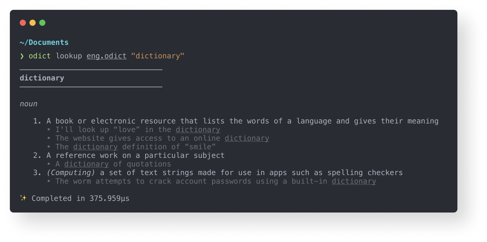

  

The Open Dictionary Project (ODict for short), is an open-source, modern alternative to dictionary file formats like [StarDict](https://github.com/huzheng001/stardict-3), [Babylon](https://www.babylon-software.com/product-category/premium-dictionaries/) and [Apple Dictionaries](https://en.wikipedia.org/wiki/Dictionary_(software)). 

It is:

:zap: **Fast.** Entry lookups take less than 1s and don't require indexing.

:brain: **Easy.** ODict files are written using dead-simple XML and compiled to binary.

:pinching_hand: **Tiny.** A single dictionary can store thousands of entries and stay under 1MB.

:package: **Portable.** ODict is a single executable written in Rust that can run almost anywhere.

Wondering how to get started? Check out our [Quickstart](https://www.odict.org/docs/introduction/quickstart) or read our [official documentation](https://odict.org).
