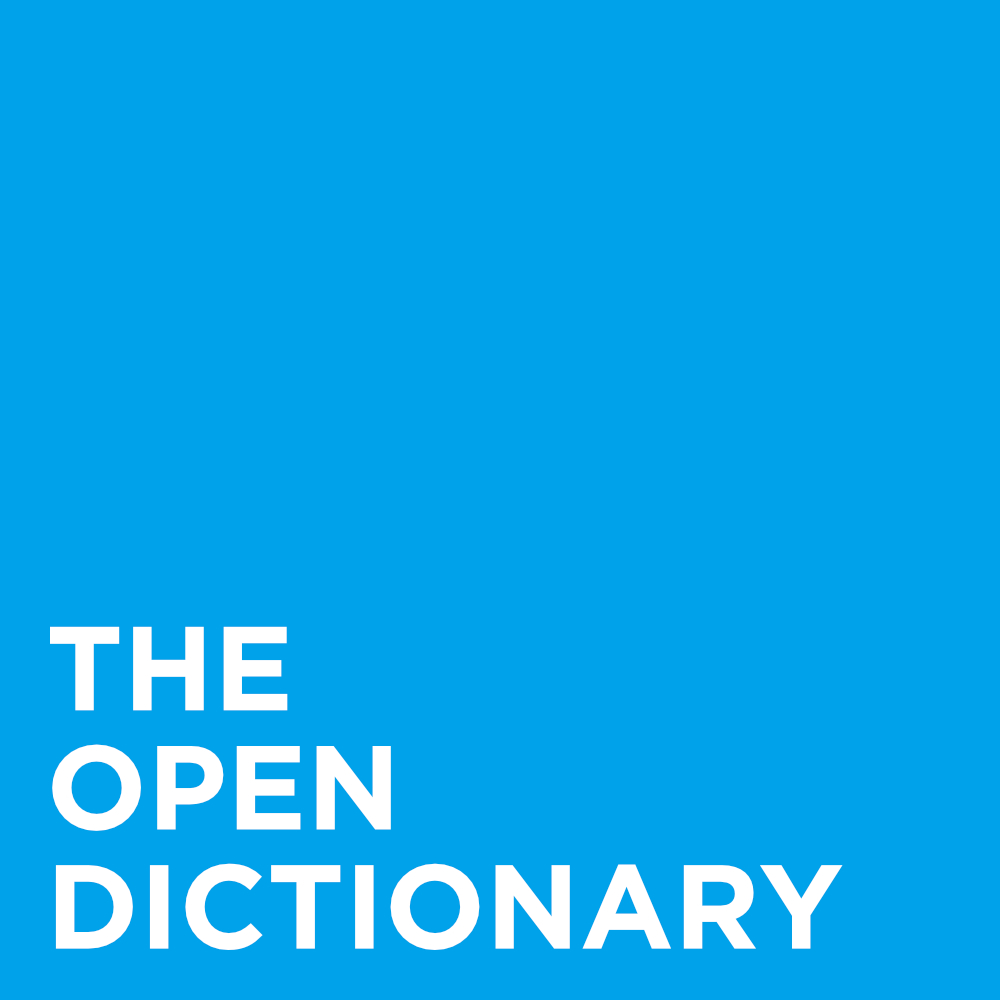
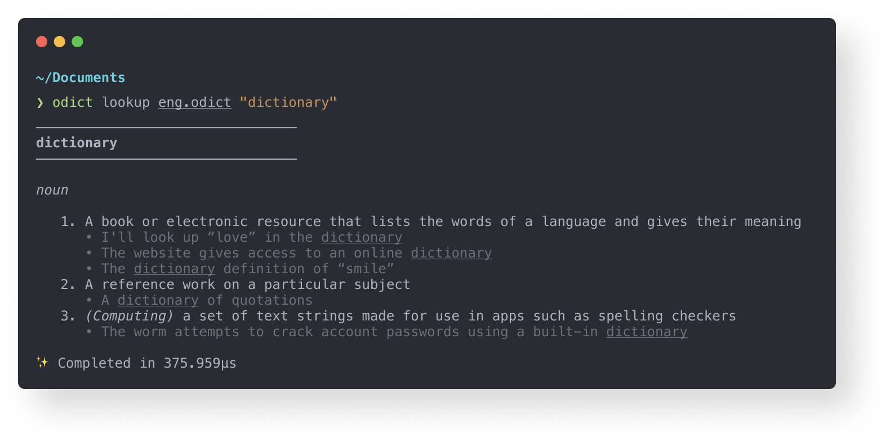

<div align="center">


<br/><br/>


</div>

The Open Dictionary Project (ODict for short), is an open-source, modern alternative to dictionary file formats like [StarDict](https://github.com/huzheng001/stardict-3), [Babylon](https://www.babylon-software.com/product-category/premium-dictionaries/) and [Apple Dictionaries](https://en.wikipedia.org/wiki/Dictionary_(software)). 

It is:

:zap: **Fast.** Entry lookups take less than 1s and don't require indexing.

:brain: **Easy.** ODict files are written using dead-simple XML and compiled to binary.

:pinching_hand: **Tiny.** A single dictionary can store thousands of entries and stay under 1MB.

:package: **Portable.** ODict is a single executable written in Go that can run almost anywhere.

<div align="center">

</div>

## Getting Started

### ⬇️ Installing ODict

To get started with ODict, first you'll want to install the official [`odict` CLI](./docs/cli.md). 

Fortunately, this is super easy. Make sure you have at least Go v1.9 installed, then run:

```bash
$ go install github.com/TheOpenDictionary/odict@latest
```

Alternatively, if you're a Mac user, you can install via [Homebrew](https://brew.sh):

```
$ brew tap TheOpenDictionary/odict
$ brew install odict
```

### ✍🏻 Writing Your First Dictionary

In your favorite text editor, create a new file called `mydictionary.xml` and add the following:

```xml
<dictionary name="My Dictionary">  
  <entry term="Hello world">  
    <ety>
      <usage>
        <definition value="A greeting typically used by programmers">
          <example>I passed Bill Gates' house and he shouted "hello world!" at me from an upstairs window.</example>
        </definition>
      </usage>
    </ety>
  </entry>
</dictionary>
```

Not sure exactly what's going on? Let's go through it line-by-line ⬇️

<details>
<summary>Break it down 🕺🏻</summary>

- Our first XML block, `<dictionary>`, defines a the dictionary object.
  - All ODict dictionaries will start and end with a `dictionary` tag. 
  - Dictionaries can also have names and IDs, which can help identify it or the source it came from.
- Directly within our `dictionary` block are `<entry>` tags, which allow us to define the dictionary entries. 
  - Each entry **must** have a `term` attribute, which will be used as a case-insensitive key to perform lookups with. This should be the word you are defining.
  - Entries also can have an optional `see` attribute (short for "see also"), which allow you to link entries together. For example, you may want to associate a conjugated word with its base form.
- Inside entries are _etymologies_ (shorted to `ety`). 
  - Etymologies are used to describe the historic origin of a word (for example if a word comes from Latin or Greek). 
  - Most words will typically only have one etymology. 
- Inside etymologies are _usages_ (often also known as "senses") and are written using the `<usage>` tag. 
  - Usages are how a word is _used_ (surprise surprise!), typically denoted by part-of-speech (POS). For example, _dive_ can be both a verb (e.g. the boy can _dive_) or an adjective (e.g. he stumbled into a _dive_ bar). These would appear as two unique usages of "dive".
  - Most, if not all usages, should have a valid `pos` attribute by which to identify it. There cannot be any duplicate `pos` attributes used in a single etymology's usages. If you don't specify a `pos`, however, it will default to "un" (unknown).
- Usages can contain either definitions or definition groups. Seeing we're only specifying a definition here, let's focus on only that.
  - `<definition>` tags accept a `value` attribute which contains the definition of the word. Originally you could pass the definition string as a child (such as `<definition>this</definition>`), until we introduced example sentences.
- Inside a `<definition>` declaration you can specify `<example>` sentences to demonstrate the usage of the word, which we are leveraging above.

</details>

### ♻️ Compiling Your Dictionary

Now that we have our dictionary's source file ready, we can compile it to a compress ODict binary! 

Doing so is super simple:

```bash
$ odict compile mydictionary.xml
```

This will output `mydictionary.odict` in the same directory. If you want to change the output file, you can use the `-o` flag:

```bash 
$ odict compile -o mydict.odict mydictionary.xml
```

### 🔍 Performing Lookups

Now let's try it to query your new, compiled dictionary. To search for "hello world", just run:

```bash
$ odict lookup mydictionary.odict "hello world"
```

and you should see the following appear in your terminal:

<!-- TODO: add output -->

### ➡️ Next Steps

Congrats! You've taken your first step towards being an accomplished dictionary author. Next you may be interested in either [learning how to use one of ODict's programmatic APIs], [learning more about its file format], or [mastering the CLI].

## 🙋🏻 Why Build This?

In case you're wondering why this exists, [see here](./docs/motivation.md).

## :heart: Adopters 

If you're using ODict in your project, feel free to add your name to the list!

- [Linguistic](https://linguistic.io)