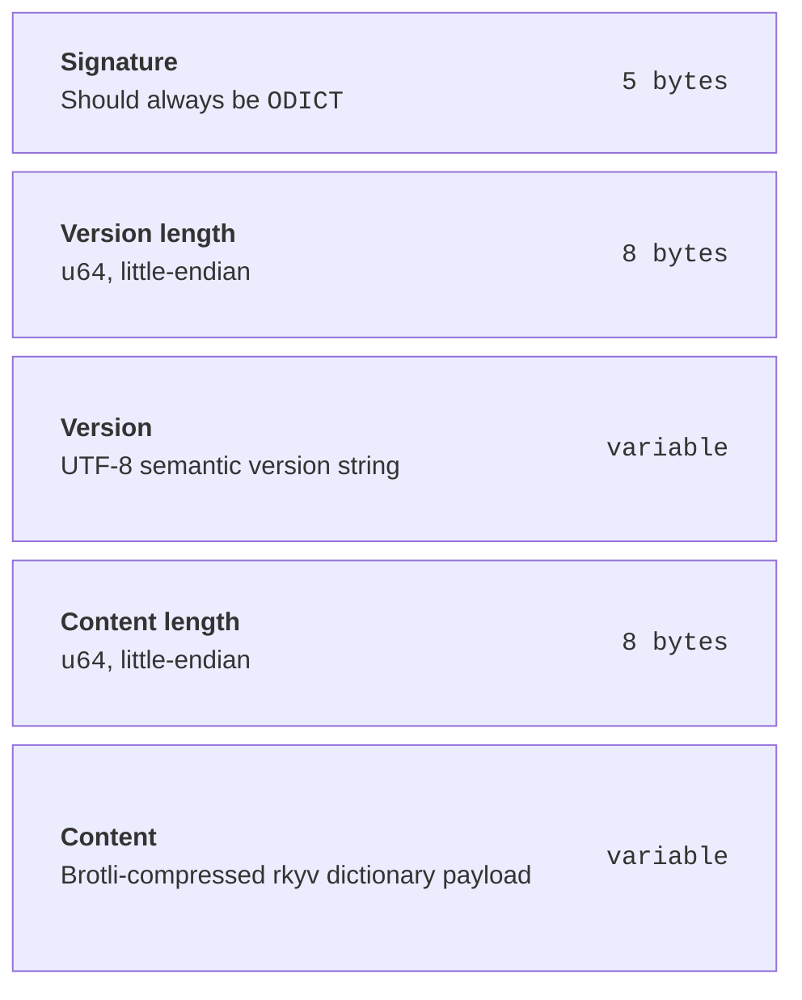

**ODict** (The Open Dictionary) is a fast, open-source dictionary file format for human languages. It is built for offline retrieval of lexical data
such as etymologies, senses, pronunciations, examples, and definitions.

Similar projects include [StarDict](https://en.wikipedia.org/wiki/StarDict), [DICT](https://en.wikipedia.org/wiki/DICT),
[XDXF](https://en.wikipedia.org/wiki/XDXF), and platform-specific dictionary formats. ODict's goal is to keep the authoring format simple while making
the compiled dictionary small, portable, and quick to query.

ODict provides a complete pipeline for defining, compiling, and querying dictionaries:

1. **Define** your dictionary entries in a simple XML format (ODXML)
2. **Compile** the XML into a compact binary `.odict` file
3. **Query** the compiled dictionary using exact lookups, full-text search, or multi-language tokenization

## Why ODict?

Most dictionary data is locked in proprietary formats, scattered across inconsistent APIs, or stored in slow, bloated files. ODict addresses these
problems:

- **Universal schema** — A single, well-defined XML schema that can represent dictionaries for any human language, including etymologies, multiple
  senses, pronunciations, examples, and cross-references.
- **Fast binary format** — Compiled `.odict` files use [rkyv](https://rkyv.org/) for zero-copy deserialization and Brotli compression, making lookups
  extremely fast even on large dictionaries.
- **Full-text search** — Built-in indexing and search powered by [Tantivy](https://github.com/quickwit-oss/tantivy).
- **Multi-language tokenization** — Tokenize text in Chinese, Japanese, Korean, Thai, Khmer, German, Swedish, and Latin-script languages, and
  automatically match tokens to dictionary entries.
- **Cross-platform bindings** — Use ODict from Rust, Python, JavaScript (Node.js and browser), or through the CLI and HTTP server.

## Binary file layout

An `.odict` file wraps a compressed dictionary payload with a small binary header. Readers validate the magic signature and version before
decompressing the rkyv-serialized dictionary data.

## What's next?

- [Install the CLI](/getting-started/installation/) to start working with dictionaries
- [Quick Start](/getting-started/quickstart/) walks you through creating and compiling your first dictionary
- Browse the [Schema Overview](/schema/overview/) to learn the data model
