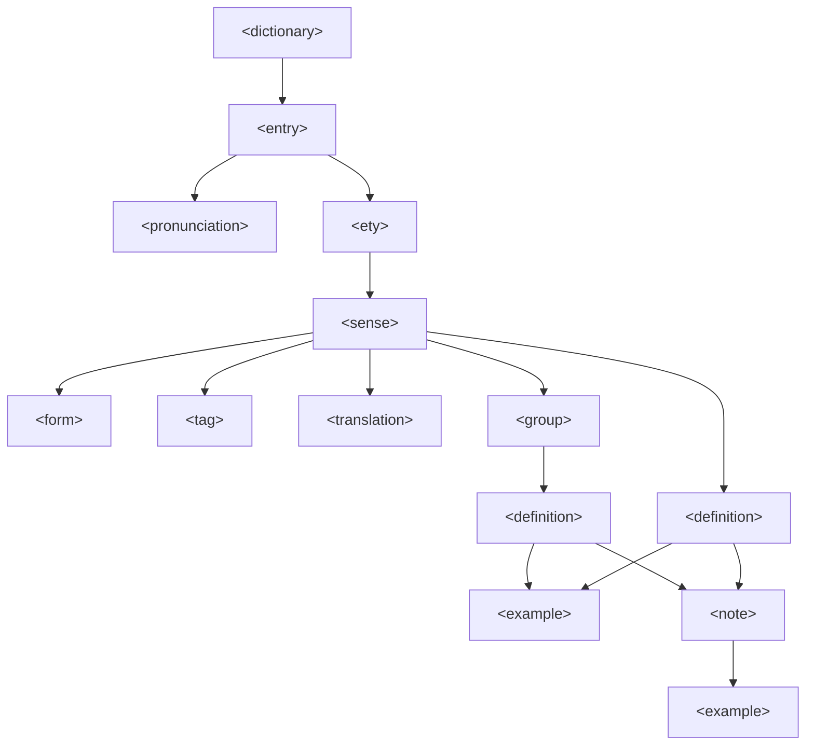

ODict dictionaries are authored in XML using the **ODXML** (Open Dictionary XML) format. This page provides a conceptual overview of how the schema is structured, from minimal dictionary entries to richer lexical data such as ranks, pronunciations, media, forms, tags, translations, lemmas, notes, and examples. For the element-by-element reference, see the [Schema Reference](/schema/reference/).

## Structure

An ODXML file describes a dictionary as a hierarchy:



## Minimal example

The simplest valid dictionary:

```xml
<dictionary>
  <entry term="hello">
    <ety>
      <sense pos="intj">
        <definition value="A greeting" />
      </sense>
    </ety>
  </entry>
</dictionary>
```

## Entries and cross-references

Each `<entry>` represents a headword. Entries can either contain full definitions (via `<ety>` children) or redirect to another entry using the `see` attribute:

```xml
<entry term="run">
  <ety>
    <sense pos="v">
      <definition value="To move swiftly on foot" />
    </sense>
  </ety>
</entry>

<!-- "ran" redirects to "run" -->
<entry term="ran" see="run" />
```

When looking up "ran" with the `follow` option enabled, ODict will resolve the cross-reference and return the "run" entry.

Use `rank` on an entry when you have frequency data. Lower or higher rank semantics are up to the source dictionary, but ODict exposes `min_rank` and `max_rank` in the language bindings so applications can normalize the values.

```xml
<entry term="run" rank="100">
  <ety>
    <sense pos="v">
      <definition value="To move swiftly on foot" />
    </sense>
  </ety>
</entry>
```

## Etymologies

If a word has multiple distinct origins, you can define multiple `<ety>` elements:

```xml
<entry term="bank">
  <ety description="From Italian banca (bench)">
    <sense pos="n">
      <definition value="A financial institution" />
    </sense>
  </ety>
  <ety description="From Old Norse bakki">
    <sense pos="n">
      <definition value="The land alongside a river" />
    </sense>
  </ety>
</entry>
```

## Senses and parts of speech

Within an etymology, `<sense>` elements group definitions by part of speech. The `pos` attribute accepts standard codes like `n` (noun), `v` (verb), `adj` (adjective), etc. See the [reference](/schema/reference/#parts-of-speech) for the full list.

```xml
<sense pos="n">
  <definition value="An animal" />
</sense>
<sense pos="v">
  <definition value="To follow persistently" />
</sense>
```

If the part of speech is unknown or not applicable, you can omit `pos` entirely.

Use `lemma` on a sense when the sense should point back to another headword:

```xml
<entry term="running">
  <ety>
    <sense pos="v" lemma="run">
      <definition value="The present participle of run" />
    </sense>
  </ety>
</entry>
```

## Forms

Use `<form>` to describe inflections, conjugations, plurals, comparatives, and other related forms:

```xml
<entry term="run">
  <ety>
    <sense pos="v">
      <form kind="conjugation" term="ran" />
      <form kind="conjugation" term="running" />
      <definition value="To move swiftly on foot" />
    </sense>
  </ety>
</entry>
```

Forms can also carry tags:

```xml
<form kind="plural" term="words">
  <tag>archaic</tag>
</form>
```

## Tags

Tags describe usage labels such as register, dialect, domain, or grammar notes:

```xml
<sense pos="n">
  <tag>informal</tag>
  <tag>slang</tag>
  <definition value="A person, especially a man" />
</sense>
```

## Translations

Translations can appear on senses and examples:

```xml
<sense pos="intj">
  <translation lang="es" value="hola" />
  <translation lang="fr" value="bonjour" />
  <definition value="A greeting">
    <example value="Hello, world!">
      <translation lang="es" value="Hola, mundo!" />
    </example>
  </definition>
</sense>
```

## Definition groups

When a sense has many definitions, you can organize them with `<group>`:

```xml
<sense pos="v">
  <group description="Motion senses">
    <definition value="To move swiftly on foot" />
    <definition value="To flee" />
  </group>
  <group description="Operational senses">
    <definition value="To operate or manage" />
    <definition value="To execute a program" />
  </group>
</sense>
```

## Examples and notes

Definitions can have `<example>` and `<note>` children. Use notes for extra context tied to a definition:

```xml
<definition value="A small domesticated mammal">
  <example value="The cat sat on the mat." />
  <example value="She adopted two cats." />
  <note value="Informal usage can also refer to a person">
    <example value="He's a cool cat." />
  </note>
</definition>
```

## Pronunciations and media

Pronunciations can be attached at the entry level and support any phonetic system. Media URLs can point to absolute URLs or relative paths:

```xml
<entry term="hello">
  <pronunciation kind="ipa" value="həˈləʊ">
    <url src="./audio/hello_uk.mp3" type="audio/mpeg" description="British" />
  </pronunciation>
  <pronunciation kind="ipa" value="hɛˈloʊ">
    <url src="./audio/hello_us.mp3" type="audio/mpeg" description="American" />
  </pronunciation>
  <ety>
    <sense pos="intj">
      <definition value="A greeting">
        <example value="Hello, how are you?">
          <pronunciation kind="ipa" value="həˈləʊ haʊ ɑː juː" />
        </example>
      </definition>
    </sense>
  </ety>
</entry>
```

This is especially useful for non-Latin scripts:

```xml
<entry term="你好">
  <pronunciation kind="pinyin" value="nǐ hǎo" />
  <pronunciation kind="ipa" value="ni˨˩ xɑʊ̯˧˥" />
  ...
</entry>
```

## XSD validation

The schema is formally defined in [`odict.xsd`](https://github.com/TheOpenDictionary/odict/blob/main/odict.xsd). You can validate your XML against it:

```xml
<?xml version="1.0" encoding="UTF-8"?>
<dictionary name="My Dictionary"
  xmlns:xsi="http://www.w3.org/2001/XMLSchema-instance"
  xsi:noNamespaceSchemaLocation="odict.xsd">
  ...
</dictionary>
```

Most XML editors (VS Code with the XML extension, IntelliJ, etc.) will provide autocomplete and validation when the XSD is referenced.

:::note
The XSD covers the stable core shape. ODict's Rust schema and language bindings also expose richer fields such as ranks, tags, forms, and translations when modeling larger dictionaries.
:::
